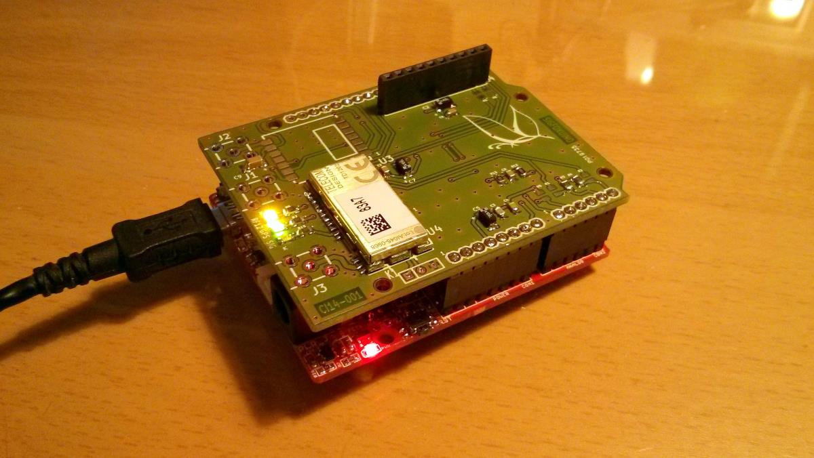
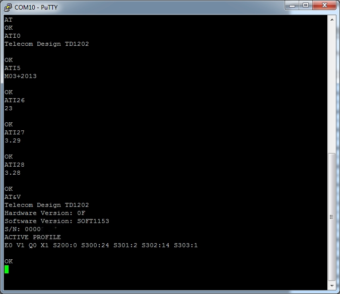
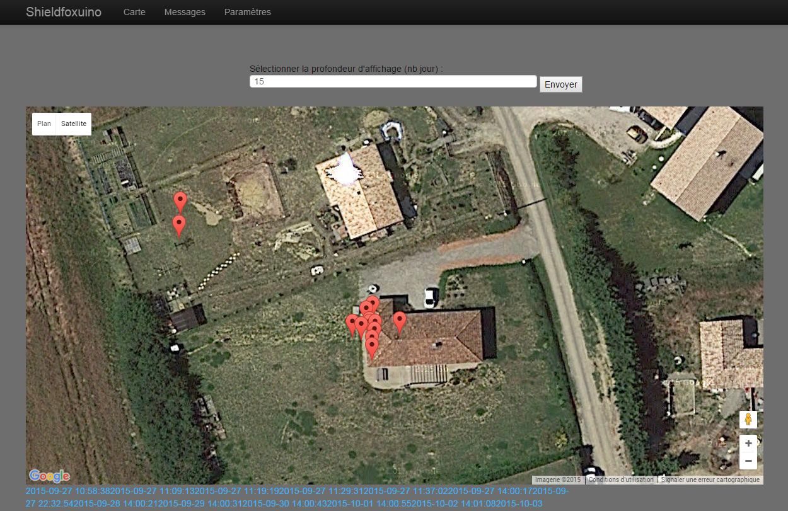

Shieldfoxuino
============

GPS tracker on an Olimexino-328 board + my Shield with TD1202 (SIGFOX) and GPS modules

More info about sigfox and Telecom Design modules : 

- http://www.sigfox.com/
- http://rfmodules.td-next.com/

How it works ?
============

SIGFOX is an IoT network provider, it allows devices to send data with long range distance. Payload message is light (12 bytes), but it is very low power and subscription is cheap.
Messages are stored in SIGFOX server that is accessible from any device connected to the Internet.

 
(source http://www.ekito.fr/)

The shieldfoxuino tracker is composed with a shield plugged in the olimexino-328.

 * Use Sigfow network for communication (uplink only, bidirecionnal mode is NOT supported),
 * Use GPS for geolocalisation and geofencing,
 * Monitor LiPo cell voltage and can set an alarm on low power,
 * Monitor temperature,
 * Serial messages are for debug purpose only.

 
 
Applications
============ 

 * My application : GPS tracker / Geofencing for my robomow (anti theft)
 * Other application without modifying source code : Geofencing, monitoring for yatch / boat parked at the harbor, ...
 * Other applications which some modification : GPS tracker for car / truck / caravan , freezer monitoring in second home when power outage, ...
 

Principles
============

##Geofencing

The device check if GPS position is inside an round area centered on an custom coordinates.
When device is outside this area, a message alert is through Sigfox to your server. Server application can warn you by email or SMS.

##Daily report
Each day, shieldfoxuino send a message as a keepalive message.
Message is the same as the geofencing message.

##Analog inputs

The device can monitor some analog inputs :

- LiPo battery : linkitone API only return these levels : 0 - 33 - 66 - 100% . So, by default, an SMS alert is sent to your phone when LiPo voltage is lower than 33%. This trigger is not customizable by SMS.

- Power supply voltage : device read voltage of this input and can send an SMS when is lower than a trigger. This value can be set by SMS. Default value is 11.6V (for a 12V lead battery).

## Serial port

Serial port is available on micro USB connector. It is only for debugging purpose. No maintenance or configuration messages are available through this serial port.

Screenshots
============

#Hardware setup

 
Instructions
============

Don't forget to set your settings in this file :

	~\shieldfoxuino\soft\sketche_sigfoxuino\sketche_sigfoxuino.h
	

Compile files and uploard to olimexino-328 with arduino IDE (follow instructions in Developer's guide)

Software
============
Arduino IDE version must be 1.5.0 ! (newer version are not supported yet).

Sigfox serial interface driver is forked from this hub :
https://github.com/Ekito/hackerz_aker

API IoT 
============
Once message is send to SIGFOX network, the only way to get this message is to run a request from a machine connected to the Internet (server, computer, mobile phone ...)
You have to ask to your Sigfox provider the API side.

  * backend SIGFOX : [[https://backend.sigfox.com]]
  * backend Telecom Design : [[https://developers.insgroup.fr/]]

Hardware
============
- Olimexino-328

https://www.olimex.com/Products/Duino/AVR/OLIMEXINO-328/open-source-hardware

- plastic case

http://www.seeedstudio.com/depot/General-Plastic-Case-25x60x100-mm-p-1001.html

	

Troubleshooting
============

TODO